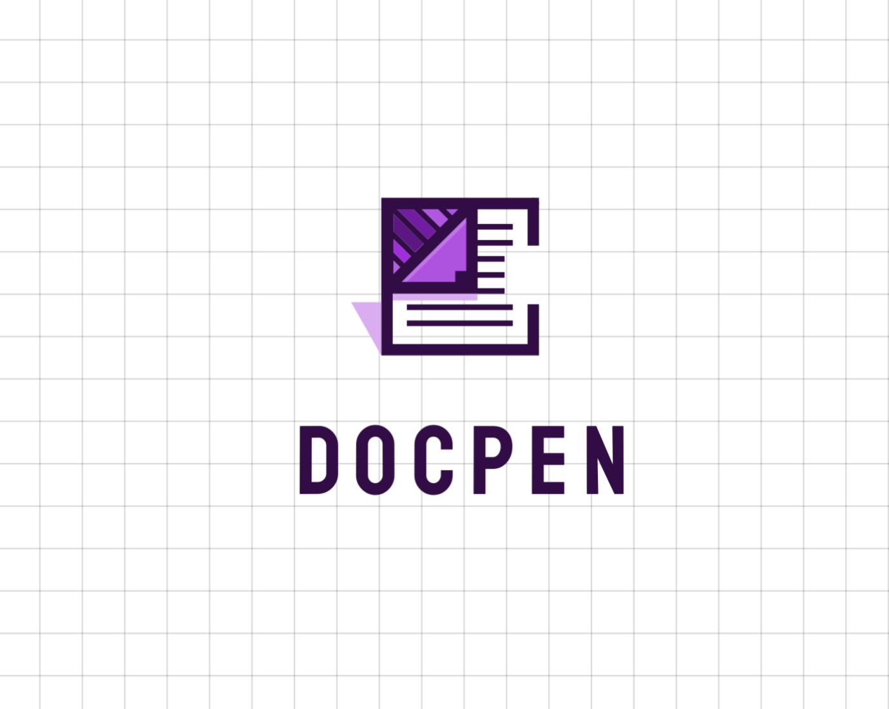

# DOCPEN



**Our online collaborative text editor platform is designed to facilitate seamless and productive teamwork. Whether you're working on a single document or managing multiple projects, our platform provides a robust environment for real-time collaboration and efficient communication with ease.**


## WHY TO USE THIS APPLICATION

- Eye friendly dark mode for long work time.
- Seamless collaboration with memebers.
- Live previews of changes.
- Constructive comments for your work partner.
- Cross platform accessibility.


## PACKAGES AND MOUDLES

```bash
    npm install @clerk/nextjs@^5.2.4
    npm install @clerk/themes@^2.1.12
    npm install @lexical/react@^0.16.1
    npm install @liveblocks/client@^2.3.0
    npm install @liveblocks/node@^2.3.0
    npm install @liveblocks/react@^2.3.0
    npm install @liveblocks/react-lexical@^2.3.0
    npm install @liveblocks/react-ui@^2.3.0
    npm install @radix-ui/react-dialog@^1.1.1
    npm install @radix-ui/react-label@^2.1.0
    npm install @radix-ui/react-popover@^1.1.1
    npm install @radix-ui/react-select@^2.1.1
    npm install @radix-ui/react-slot@^1.1.0
    npm install @sentry/nextjs@^8.18.0
    npm install class-variance-authority@^0.7.0
    npm install clsx@^2.1.1
    npm install jsm-editor@^0.0.12
    npm install lexical@^0.16.1
    npm install lucide-react@^0.408.0
    npm install nanoid@^5.0.7
    npm install next@14.2.5
    npm install react@^18
    npm install react-dom@^18
    npm install tailwind-merge@^2.4.0
    npm install tailwindcss-animate@^1.0.7

```


## RUNNING THE PROJECT LOCALLY

Git clone or fork the repository

```bash
    cd docpen
```
Install all the required packages and modules
```bash
    npm install 
```
    
## API REFERENCE

#### LIVEBLOCKS

```http
  https://liveblocks.io/
```
| Parameter | Type     | Description                |
| :-------- | :------- | :------------------------- |
| `NEXT_PUBLIC_LIVEBLOCKS_PUBLIC_KEY` | `string` | **REQUIRED** (Your PUBLIC API key) |
| `LIVEBLOCKS_SECRET_KEY` | `string` | **REQUIRED** (Your SECRET API key) |

#### CLERK AUTHENTICATION

```http
  https://clerk.com/
```
| Parameter | Type     | Description                |
| :-------- | :------- | :------------------------- |
| `NEXT_PUBLIC_CLERK_PUBLISHABLE_KEY` | `string` | **REQUIRED** (Your PUBLISHABLE API key) |
| `CLERK_SECRET_KEY` | `string` | **REQUIRED** (Your SECRET API key) |
| `NEXT_PUBLIC_CLERK_SIGN_IN_URL` | `string` | **/sign-in** |
| `NEXT_PUBLIC_CLERK_SIGN_UP_URL` | `string` | **/sign-up** |


## SETTING UP ENVIRONMENTAL VARIABLES

To run this project, you will need to add the following environment variables to your `.env` file.

```bash
    NEXT_PUBLIC_CLERK_PUBLISHABLE_KEY=
    CLERK_SECRET_KEY=
    
    NEXT_PUBLIC_CLERK_SIGN_IN_URL=/sign-in
    NEXT_PUBLIC_CLERK_SIGN_UP_URL=/sign-up

    NEXT_PUBLIC_LIVEBLOCKS_PUBLIC_KEY=
    LIVEBLOCKS_SECRET_KEY=
```

## PROJECT CONTRIBUTION

Contributions are always welcome!
`contributing.md` will be added soon.

## AUTHOR

- [@SUVAJIT-KARMAKAR](https://github.com/SUVAJIT-KARMAKAR)

